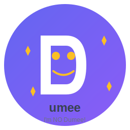



  
  <h1 align="center">
    <a href="https://dum.ee">Dumee - I'm NO Dumee!</a>
  </h1>

  
  
  

  <strong>🚀 Easy Deployment Options Coming Soon!</strong>

# ✨ Features

- 🖥️ **UI & Experience** inspired by ChatGPT with enhanced design and features

- 🤖 **AI Model Selection**:  
  - Anthropic (Claude), AWS Bedrock, OpenAI, Azure OpenAI, Google, Vertex AI, OpenAI Responses API (incl. Azure)
  - **Custom Endpoints**: Use any OpenAI-compatible API with Dumee, no proxy required
- Compatible with Local & Remote AI Providers:
    - Ollama, groq, Cohere, Mistral AI, Apple MLX, koboldcpp, together.ai,
    - OpenRouter, Perplexity, ShuttleAI, Deepseek, Qwen, and more

- 🔧 **Code Interpreter API**: 
  - Secure, Sandboxed Execution in Python, Node.js (JS/TS), Go, C/C++, Java, PHP, Rust, and Fortran
  - Seamless File Handling: Upload, process, and download files directly
  - No Privacy Concerns: Fully isolated and secure execution

- 🔦 **Agents & Tools Integration**:  
  - **Dumee Agents**:
    - No-Code Custom Assistants: Build specialized, AI-driven helpers without coding  
    - Flexible & Extensible: Use MCP Servers, tools, file search, code execution, and more  
    - Compatible with Custom Endpoints, OpenAI, Azure, Anthropic, AWS Bedrock, Google, Vertex AI, Responses API, and more
    - Model Context Protocol (MCP) Support for Tools

- 🔍 **Web Search**:  
  - Search the internet and retrieve relevant information to enhance your AI context
  - Combines search providers, content scrapers, and result rerankers for optimal results
  - Powerful web search capabilities for enhanced AI context

- 🪄 **Generative UI with Code Artifacts**:  
  - [Code Artifacts](https://youtu.be/GfTj7O4gmd0?si=WJbdnemZpJzBrJo3) allow creation of React, HTML, and Mermaid diagrams directly in chat

- 🎨 **Image Generation & Editing**
  - Text-to-image and image-to-image with GPT-Image-1
  - Text-to-image with DALL-E (3/2), Stable Diffusion, Flux, or any MCP server
  - Produce stunning visuals from prompts or refine existing images with a single instruction

- 💾 **Presets & Context Management**:  
  - Create, Save, & Share Custom Presets  
  - Switch between AI Endpoints and Presets mid-chat
  - Edit, Resubmit, and Continue Messages with Conversation branching  
  - Fork Messages & Conversations for Advanced Context control

- 💬 **Multimodal & File Interactions**:  
  - Upload and analyze images with Claude 3, GPT-4.5, GPT-4o, o1, Llama-Vision, and Gemini 📸  
  - Chat with Files using Custom Endpoints, OpenAI, Azure, Anthropic, AWS Bedrock, & Google 🗃️

- 🌎 **Multilingual UI**:  
  - English, 中文, Deutsch, Español, Français, Italiano, Polski, Português Brasileiro
  - Русский, 日本語, Svenska, 한국어, Tiếng Việt, 繁體中文, العربية, Türkçe, Nederlands, עברית

- 🧠 **Reasoning UI**:  
  - Dynamic Reasoning UI for Chain-of-Thought/Reasoning AI models like DeepSeek-R1

- 🎨 **Customizable Interface**:  
  - Customizable Dropdown & Interface that adapts to both power users and newcomers

- 🗣️ **Speech & Audio**:  
  - Chat hands-free with Speech-to-Text and Text-to-Speech  
  - Automatically send and play Audio  
  - Supports OpenAI, Azure OpenAI, and Elevenlabs

- 📥 **Import & Export Conversations**:  
  - Import Conversations from ChatGPT, Chatbot UI, and other platforms  
  - Export conversations as screenshots, markdown, text, json

- 🔍 **Search & Discovery**:  
  - Search all messages/conversations

- 👥 **Multi-User & Secure Access**:
  - Multi-User, Secure Authentication with OAuth2, LDAP, & Email Login Support
  - Built-in Moderation, and Token spend tools

- ⚙️ **Configuration & Deployment**:  
  - Configure Proxy, Reverse Proxy, Docker, & many Deployment options  
  - Use completely local or deploy on the cloud

- 📖 **Open-Source & Community**:  
  - Completely Open-Source & Built in Public  
  - Community-driven development, support, and feedback

For a thorough review of our features, check out our documentation! 📚

## 🪶 All-In-One AI Conversations with Dumee

Dumee brings together the future of assistant AIs with fun, meme-driven explanations and user-created agents. Building on proven technology, Dumee gives you the ability to integrate multiple AI models while keeping things engaging and accessible. "I'm NO Dumee!" - because smart AI shouldn't be boring.

With Dumee, you no longer need to opt for expensive subscription services and can instead use free or pay-per-call APIs. We welcome contributions, cloning, and forking to enhance the capabilities of this advanced AI platform.

*Demo video coming soon! 🎬*

---

## 🌐 Resources

**Dumee:**
  - **Website:** [dum.ee](https://dum.ee)
  - **Documentation:** [dum.ee/docs](https://dum.ee/docs)
  - **GitHub:** [github.com/your-username/dumee](https://github.com/your-username/dumee)

---

## 📝 Changelog

Keep up with the latest updates:
- [Releases](https://github.com/your-username/dumee/releases)
- [Changelog](https://dum.ee/changelog)

**⚠️ Please consult the changelog for breaking changes before updating.**

---

## ⭐ Star History

  <strong>⭐ If you find Dumee helpful, please give us a star on GitHub!</strong>

---

## ✨ Contributions

Contributions, suggestions, bug reports and fixes are welcome!

For new features, components, or extensions, please open an issue and discuss before sending a PR.

If you'd like to help translate Dumee into your language, we'd love your contribution! Improving our translations makes Dumee more accessible to users around the world. Check out our translation guide for more information.

---

## 💖 This project exists in its current state thanks to all the people who contribute

---

## 🎉 Special Thanks

We thank [Locize](https://locize.com) for their translation management tools that support multiple languages in Dumee.

  

